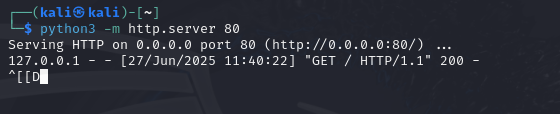

Elevate Labs Internship D04  

Task 04 : Setup and Use a Firewall on Linux  

Objective: Configure and test basic firewall rules to allow or block traffic.  
Tools: UFW (Uncomplicated Firewall) on Linux.  
Deliverables: Screenshot/configuration file showing firewall rules applied.  

Step 1: 
Install UFW (if not already installed)  
```sudo apt update```  
```sudo apt install ufw```  


Step 2: Enable UFW  
```sudo ufw enable```  


Step 3: Add Rules  
```# Allow SSH (port 22)```  
```sudo ufw allow ssh```  

```# Allow HTTP (port 80)```  
```sudo ufw allow 80/tcp```  

```# Block Telnet (port 23)```  
```sudo ufw deny 23/tcp```  

```# Deny all incoming by default (optional stricter policy)```  
```sudo ufw default deny incoming```  
```sudo ufw default allow outgoing```  
  

Step 4: View Applied Rules  
```sudo ufw status numbered```  
  

Step 5: Test firewall rules  

1. Test SSH (Port 22) — Allowed  
```ssh localhost```  
If allowed, it connects to your own system (or from another system on LAN).  
If blocked: you'll get Connection refused or Permission denied.  
  

2. Test HTTP (Port 80) — Allowed  
Start a temporary HTTP server  
```python3 -m http.server 80```  
 
In another terminal  
```curl http://localhost```  
  

3. Test Telnet (Port 23) — Blocked  
```telnet localhost 23```  
If UFW is blocking port 23, it should hang or say Unable to connect to remote host.  
If allowed, and port is open, you'd get a response (rare if no Telnet server is installed).  

